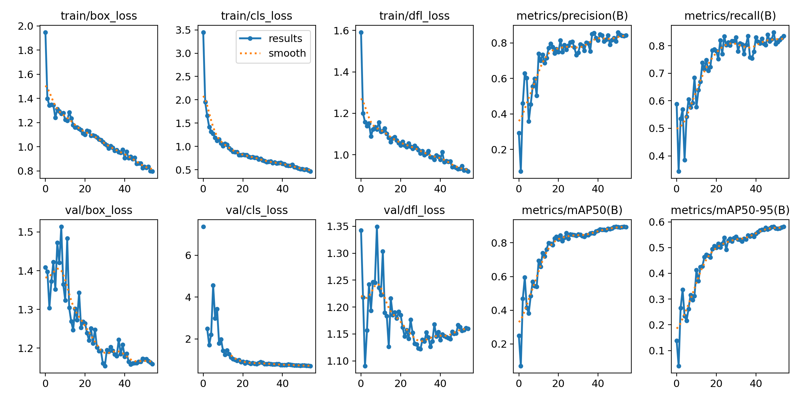

# Classroom Cellphone Detection using YOLOv8

## Project Overview

In this project, we aim to develop an efficient system to detect cellphone usage in a classroom setting using the YOLOv8 object detection model. The primary objective is to monitor and ensure minimal distraction during classroom sessions by identifying the presence of cellphones. YOLOv8, known for its speed and accuracy, is employed for this task.

## Dataset

### Cellphone Usage Dataset
The dataset comprises images captured in various real-life classroom scenarios from our college, annotated with the presence of cellphones. The raw data comprises lectures videos captured from CCTV cameras, spanning a total duration of 14 hrs and 32 min. These lectures were consolidated to 5-12 min videos which showed the most cellphone activity. A total of 253 frames were extracted from these videos. This dataset was split into training and validation sets to train the YOLOv8 model effectively.

### Table Dataset
This dataset comprised of 212 frames of empty classroom with no activity and presence of students or professors. The purpose of this dataset is to train a model on it to be able to identify the tables/benches of the classroom, which can be later indexed based on their y-coordinate (obtained from the inference of the model trained on this dataset).

### Annotated Images from the Dataset

*Figure 1: An annotated image of classroom with students and their cellphones.*

*Figure 2: An annotated image of empty classroom to map out the tables.*

## Model Training

We utilized YOLOv8s (small), YOLOv8m (medium), YOLOv8l (large) models for this task. The models were trained for a certain number of epochs and where later fine tuned by change the epochs and observing positive/negative changes in the training and validation loss graphs. The best performing model was YOLOv8m trained for 55 epochs, optimizing for mAP (which implicitly optimizes both precision and recall). It showed an mAP50 of 89.5%.

### Training Configuration

- **Model:** YOLOv8m (medium)
- **Epochs:** 55
- **Batch Size:** 16 (default autobatch)
- **Optimizer:** Adam (default)
- **Image Size:** 640
- **Learning Rate:** 0.001 (adaptive)

### Training Graphs

*Figure 3: Training graphs of YOLOv8m (55 epochs).*

## Prediction Results

After training, the model was evaluated on the validation set. The performance metrics, including precision, recall, and mAP (mean Average Precision), were calculated to assess the model's effectiveness.

### Prediction Image

*Figure 4: A prediction by the YOLOv8m (55 epochs) model showing detected cellphones in a classroom.*

## Results

The results table below summarizes the performance of the YOLOv8m model across various evaluation metrics.

| Epochs | Time (in hrs) | Precision | Recall | mAP50 | mAP50-95 |
|--------|---------------|-----------|--------|-------|----------|
| 30     | 0.113         | 0.857     | 0.782  | 0.864 | 0.552    |
| 45     | 0.171         | 0.843     | 0.809  | 0.873 | 0.568    |
| 50     | 0.188         | 0.842     | 0.775  | 0.873 | 0.563    |
| **55** | **0.202**     | **0.844** | **0.835**  | **0.895** | **0.581**    |
| 60     | 0.236         | 0.842     | 0.793  | 0.880 | 0.581    |

*Table 1: YOLOv8m Training Results.*

## Conclusion

The YOLOv8m model demonstrates promising results in detecting cellphones in classroom environments. With high mAP values, it proves to be an effective tool for minimizing distractions in educational settings. Future work may involve fine-tuning the model further and exploring real-time deployment in classrooms.

## References

- YOLOv8 Documentation: [YOLOv8](https://github.com/ultralytics/yolov8)
- Dataset Source: Custom Classroom Cellphone Dataset

## Acknowledgements

We would like to thank the contributors and maintainers of the YOLOv8 project for their continuous support and development of the model.

---

*Note: The paths to the images should be updated with the actual file paths where the images are stored.*
